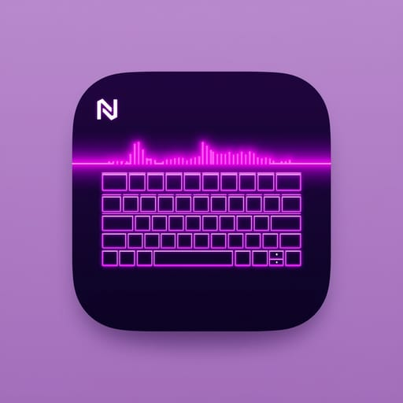
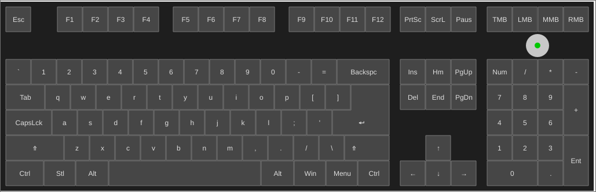
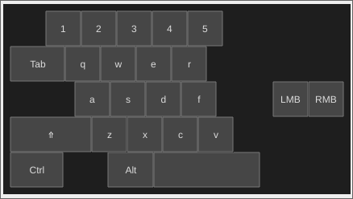
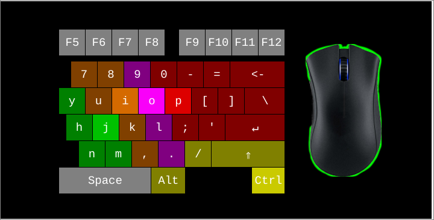

# ⚠️ **AI ALERT**

As a software developer with limited C++ expertise, I directed the development of **Nohboard QT** by iteratively prompting AI language models (Claude and DeepSeek) to generate the majority of the code. Through systematic debugging, precise requirements, and continuous validation of the AI's output, I guided the project from concept to a fully functional streaming application. This process demonstrates my ability to leverage AI tools effectively while retaining full ownership of problem‑solving and architectural decisions.

# NohBoard Qt – Cross‑Platform Keyboard Visualizer



NohBoard Qt is a modern rewrite of the original [NohBoard](https://github.com/ThoNohT/NohBoard) keyboard visualizer. It displays your keystrokes, mouse clicks, and mouse movements in a customizable on‑screen overlay.  
Built with **Qt6** and **C++17**, it runs on **Linux** (X11/Wayland), **Windows**, and **macOS**.

## Features

- **Keyboard visualization** – highlights keys as you press them, supports multiple key layouts.
- **Mouse tracking** – shows mouse buttons, scroll wheel, and a speed/direction indicator.
- **Fully customizable** – load different keyboard definitions and visual styles (JSON format).
- **On‑screen editing** – rearrange keys, edit text positions, add/remove elements, and modify styles directly.
- **Persistent settings** – window position, last loaded keyboard, and user preferences are saved.
- **Cross‑platform** – works on Linux (AppImage), Windows (standalone .exe), and macOS (universal .app).

---

## Screenshots





## Project Structure

```text
.
├── CMakeLists.txt # Main build configuration
├── cmake/ # CMake modules (e.g., WinDeployQt)
├── dist/ # Output directory for packaged builds (AppImage, .exe, .app)
├── docker/ # Dockerfiles for cross‑compilation (optional)
├── keyboards/ # Keyboard definitions and styles (bundled into the app)
├── src/ # Source code
│ ├── input/ # Input hooks (X11, Wayland, Windows, macOS)
│ ├── loaders/ # JSON loaders for keyboards/styles
│ ├── dialogs/ # UI dialogs (settings, element properties, etc.)
│ ├── models/ # Data structures
│ ├── main.cpp
│ ├── mainwindow.cpp/h
│ └── keyboardwidget.cpp/h
└── build-*.sh # Convenience build scripts
```

## Requirements for Local Development

- **CMake** ≥ 3.16
- **Qt6** (Core, Gui, Widgets, Svg)
- **C++17** compiler
- **Ninja** or **Make** (optional, CMake can generate any build system)

### Platform‑Specific Dependencies

| Platform | Required Packages |
|----------|-------------------|
| Linux (X11) | `libx11-dev`, `libxtst-dev`, `libxcb-*-dev`, `libxkbcommon-x11-dev` |
| Linux (Wayland) | `libinput-dev`, `libudev-dev`, `libxkbcommon-dev` |
| Windows (cross) | MinGW‑w64 toolchain (e.g., MXE) – see Docker scripts |
| macOS (cross) | osxcross with Qt6 (provided by Docker image) |

---

## Building Locally

### 1. Clone the Repository

```bash
git clone https://github.com/yourname/nohboard-qt.git
cd nohboard-qt
```

### 2. Configure and Build

Create a build directory and run CMake:

```bash
mkdir build && cd build
cmake .. -DCMAKE_BUILD_TYPE=Release
cmake --build . --parallel
```

The executable will be placed in the build directory (`NohBoard` on Linux/macOS, `NohBoard.exe` on Windows).

### 3. Run

```bash
./NohBoard   # Linux/macOS
NohBoard.exe # Windows
```

> **Note for Windows**: If you are compiling natively on Windows with MinGW, you will need to place the required Qt DLLs in the same folder or in your `PATH`. For a standalone .exe, see the Docker packaging instructions below.

## Creating Distributable Packages

We provide Docker‑based scripts that produce self‑contained executables for each platform. These scripts handle cross‑compilation and bundling of all dependencies (Qt, MinGW runtime, etc.).

### Prerequisites

- **Docker** installed and running
- Sufficient disk space (the MXE toolchain used for Windows builds is large, ~10 GB)

### Linux AppImage

```bash
./build-appimage.sh
```

Output: `dist/linux/NohBoard-x86_64.AppImage`

This uses `linuxdeploy` and `linuxdeploy-plugin-qt` to bundle everything into a single AppImage that runs on most Linux distributions.

## Windows Standalone Executable (static)

```bash
./build-windows.sh
```

Output: `dist/windows/NohBoard.exe`

The resulting `.exe` is fully static (no external DLLs required). It contains all Qt libraries, MinGW runtime, and the bundled keyboards.

### macOS Universal Application

```bash
./build-macos.sh
```

Output: `dist/macos/NohBoard.app`

This builds both `x86_64` and `arm64` versions, combines them with `lipo`, and runs `macdeployqt` to produce a universal `.app` that runs natively on Intel and Apple Silicon Macs.

## Configuration and Data

### Settings File

- **Linux:** `~/.local/share/NohBoard/NohBoard.json`

- **Windows:** `%LOCALAPPDATA%\NohBoard\NohBoard.json`
- **macOS:** `~/Library/Application Support/NohBoard/NohBoard.json`

This file stores window position, last loaded keyboard, and user preferences.

### Keyboard Definitions & Styles

The bundled keyboards are stored in the application’s data directory (copied from the executable on first run).
Users can add their own keyboards by placing them in the appropriate subfolder:

- **Linux:** `~/.local/share/NohBoard/keyboards/`
- **Windows:** `%LOCALAPPDATA%\NohBoard\keyboards\`
- **macOS:** `~/Library/Application Support/NohBoard/keyboards/`

Each keyboard is a folder containing a `keyboard.json` file and optional `.style` files.
Images referenced in styles should be placed in an `images` subfolder next to the `.style` file.

## Permissions

### macOS Input Monitoring

The first time you run NohBoard on macOS, it will request **Input Monitoring** permission.
If the switch in **System Settings > Privacy & Security > Input Monitoring** is greyed out, reset the permission cache:

```bash
tccutil reset InputMonitoring com.yourname.NohBoard
```

(Replace `com.yourname.NohBoard` with your actual bundle identifier, found in `Info.plist.`)

### Wayland

Wayland compositors (e.g., GNOME, KDE Plasma, Sway, Hyprland) restrict global input capture for security reasons. To use NohBoard on Wayland:

- Ensure your user is in the input group (required for reading input devices).

```bash
sudo usermod -a -G input $USER
```

Then log out and back in for the change to take effect.

- The AppImage runs under XWayland by default and should work. If it doesn’t capture input, try running in a native X11 session (log out and choose your desktop environment’s “on Xorg” option at login).

- For best results, use the AppImage or run the executable under an X11 session. Some Wayland compositors may require additional configuration to allow global input capture; this is outside the scope of this document.

## Customization

### Editing Keyboard Definitions

Right‑click on the keyboard and choose **Start Editing**. You can then:

- Select an element (its bounding box is highlighted).

- Move it up/down in the draw order.

- Remove it.

- Edit its properties (text, text position, key codes, boundaries).

- Edit the element’s style (loose/pressed colors, images, fonts) with the option to override the default style.

### Editing Global Styles

From the context menu, choose **Keyboard Style** to modify the global appearance:

- Background color/image

- Mouse speed indicator colors

- Default loose/pressed key styles (background, text, outline, font)

### Settings Dialog

Access **Settings** from the context menu to adjust:

- Input sensitivity

- Scroll hold time

- Window title

- Capitalization behavior

- Always‑on‑top, verbose logging, etc.

## Troubleshooting

### AppImage does not start on old Linux distributions

The AppImage is built on Ubuntu 20.04 for maximum compatibility. If you have a newer glibc, you may need to build it yourself using the Docker script (which uses the same base).

### Windows .exe asks for missing DLLs

Our static build should have no external dependencies. If you encounter errors, ensure you are using the latest build from the Docker script. The executable should be the only file needed.

### macOS permission greyed out

Follow the `tccutil` command above. If it still doesn’t work, remove the app from the Input Monitoring list (minus button) and add it again.

### No input capture on Wayland

Run the application in an X11 session (e.g., log out and choose “Ubuntu on Xorg” at login) or use the X11‑compatible version (the AppImage runs under XWayland by default).

## Contributing

Contributions are welcome! Please fork the repository and submit a pull request.
For major changes, open an issue first to discuss what you would like to change.

### Code Style

- Use consistent indentation (4 spaces).

- Follow Qt naming conventions (camelCase for functions, PascalCase for classes).

- Add comments for non‑obvious logic.

### License

This project is licensed under the **GPL version 2**. See the LICENSE file for details.

## Acknowledgements

- Original NohBoard by ThoNohT

- Qt6 framework

- MXE (M Cross Environment)

- linuxdeploy and linuxdeploy-plugin-qt

- osxcross and the stateoftheartio/qt6 Docker images

- All contributors and keyboard layout designers

---
Enjoy visualizing your keystrokes! 🎹
